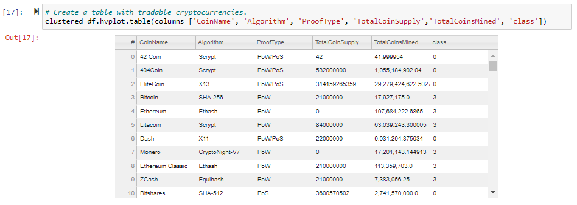

# Cryptocurrencies

## Overview:
The purpose of this project was to inspect cryptocurrencies currently trading on the market. The data was cleaned, and then charts and tables were created to display the clusters created by the unsupervised machine learning models.

## Images:
First is the elbow graph created which tells us that 4 is the best amount of clusters for this data.

Next is the 3D graph showing the clusters.

Lastly is the table of data.

